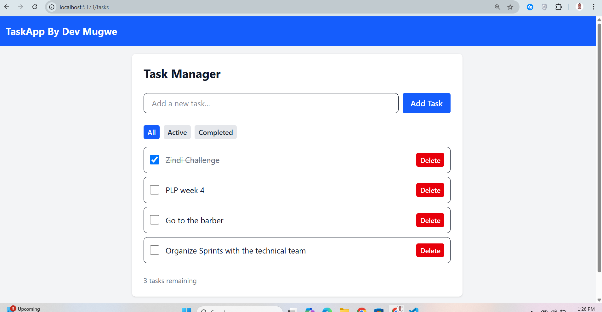
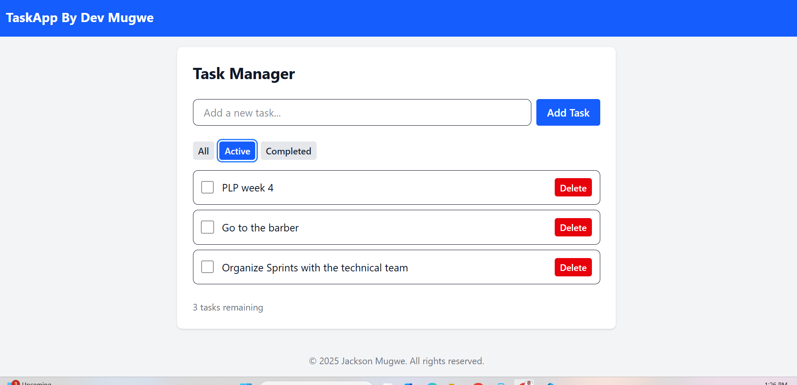
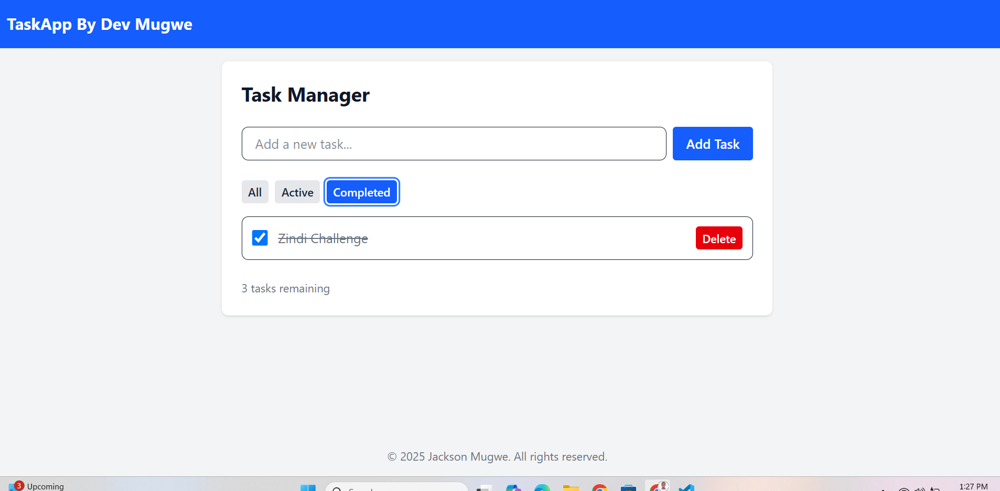

# 📚 Week 3: React.js, JSX, and Tailwind CSS – Front-End Task Manager

## 🚀 Objective

This project is a responsive React application built with Vite, React, and Tailwind CSS. It demonstrates component architecture, state management with hooks, context for theming, and API integration. The app features a Task Manager, public API data display, and a modern, mobile-friendly UI.

---

## 🛠️ Setup

1. **Clone the repository**
2. **Install dependencies**
   ```sh
   npm install
   ```
3. **Start the development server**
   ```sh
   npm run dev
   ```
4. **Open** [http://localhost:5173](http://localhost:5173) in your browser

---

## 📂 Project Structure

```
src/
  components/
    Button.jsx
    Card.jsx
    Navbar.jsx
    Footer.jsx
    Layout.jsx
  context/
    ThemeContext.jsx
  hooks/
    useLocalStorage.js
  pages/
    Home.jsx
    Tasks.jsx
    ApiData.jsx
  App.jsx
  main.jsx
  index.css
public/
  images/
    postman-post.png
    app-light.png
    app-dark.png
    api-list.png
```

---

## ✨ Features

### 1. Component Architecture

- **Reusable UI Components:**  
  - `Button` (primary, secondary, danger variants)
  - `Card` for boxed content
  - `Navbar` for navigation
  - `Footer` with links and copyright
  - `Layout` wraps pages with Navbar and Footer

### 2. State Management & Hooks

- **Task Manager:**  
  - Add, complete, delete, and filter tasks (All, Active, Completed)
  - Uses `useState` for tasks
  - Uses `useEffect` for loading/saving tasks
  - Uses `useContext` for theme (light/dark)
  - Custom `useLocalStorage` hook for persistence

### 3. API Integration

- Fetches data from [JSONPlaceholder](https://jsonplaceholder.typicode.com/posts)
- Displays data in a responsive grid
- Loading and error states
- Pagination and search functionality

### 4. Styling with Tailwind CSS

- Fully responsive (mobile, tablet, desktop)
- Theme switcher (light/dark mode)
- Tailwind utility classes for layout, spacing, and colors
- Custom transitions for interactive elements

---

## 🖼️ Screenshots
### Home page Task Manager  


###Active Tasks section  



### Completed tasks section  


---

## 🧪 Example API Usage

**Get Tasks**
```http
GET /api/tasks
```
**Response:**
```json
[
  {
    "id": 1,
    "title": "Learn React",
    "completed": false
  }
]
```

**Add Task**
```http
POST /api/tasks
{
  "title": "Build a project"
}
```

---

## 📖 Technologies Used

- [React](https://react.dev/)
- [Vite](https://vitejs.dev/)
- [Tailwind CSS](https://tailwindcss.com/)
- [React Router](https://reactrouter.com/)
- [JSONPlaceholder API](https://jsonplaceholder.typicode.com/)

---

## 📝 Author

Jack Khalif

---

## 📢 Notes

- All tasks are persisted in local storage.
- The app is fully responsive and supports dark mode.
- See the `images` folder for more screenshots.

---
